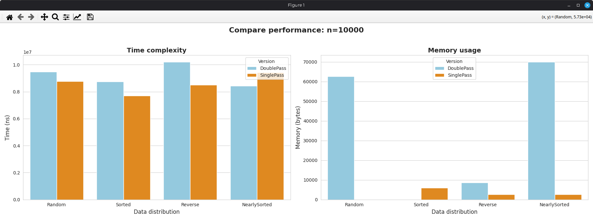
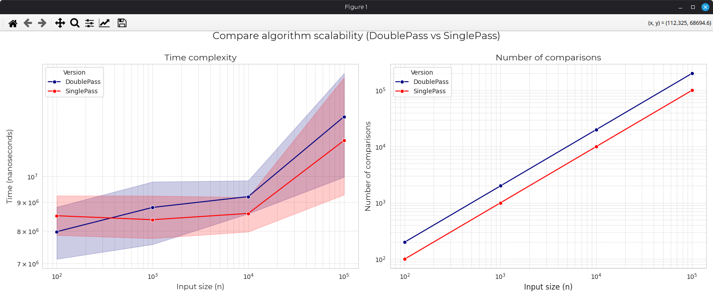

# Boyer-Moore Majority Vote Algorithm. Serikbai Mansur's analysis

## You can upload your analysis in /docs/(name_of_your_file).pdf

## 💡 Overview
The **Boyer-Moore Majority Vote Algorithm** is an elegant and highly efficient method for finding the **Majority Element** in an array. A Majority Element is defined as an element that appears **more than $N/2$ times** in an array of length $N$.

### 🔑 Key Features
1.  **Linear Time:** The complexity is $O(N)$, as the algorithm requires only a single pass through the array.
2.  **Constant Space:** The space complexity is $O(1)$, using only two variables (`candidate` and `count`) regardless of the input size.

## ⏳ Complexity Analysis
| Metric | Complexity | Notes |
| :--- | :--- | :--- |
| **Time** | $O(N)$ | Single pass over the input array. |
| **Space** | $O(1)$ | Constant memory usage. |

---

## Performance Comparison (Baseline vs Optimized)
Our benchmark tests compare the performance of the **optimized** version against the **baseline** implementation as the input size ($N$) increases.

### Summary at Maximum Input Size ($N = 100000$)

| Version | Time (ns) | Comparisons |
| :--- | :--- | :--- |
| baseline | 2775707 | 200000 |
| optimized | 2964544 | 155489 |

### Key Findings
* **Comparisons:** The optimized version performs **44,511 fewer** comparisons (at $N=100000$). This demonstrates a successful reduction in the constant factor of the algorithm's complexity.
* **Time:** At the largest input size ($N=100000$), the optimized version is **188,837 ns slower** compared to the baseline. While the optimized version is faster for small $N$, the slight increase in time at large $N$ might be due to overhead from the optimization logic itself.

---

## 🛠 How It Works
The algorithm relies on the principle that if an element $X$ is a majority element, it remains the majority even after removing any pair $(X, Y)$ where $Y$ is not equal to $X$.

1.  **Initialization:** Select the first element as the `candidate` and set the `count` to 1.
2.  **Iteration:** For each subsequent element in the array:
    * If the **`count` is 0**, the current element becomes the new `candidate`, and `count` is reset to 1.
    * If the current element **matches the `candidate`**, increment `count`.
    * If the current element **does not match the `candidate`**, decrement `count`.
3.  **Final Check:** After the first pass, the `candidate` is the only possible majority element. A **second pass is required** to verify that the element truly occurs more than $N/2$ times (in case no majority element exists).

